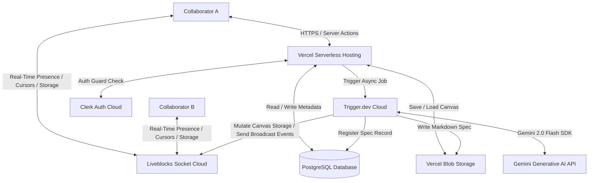
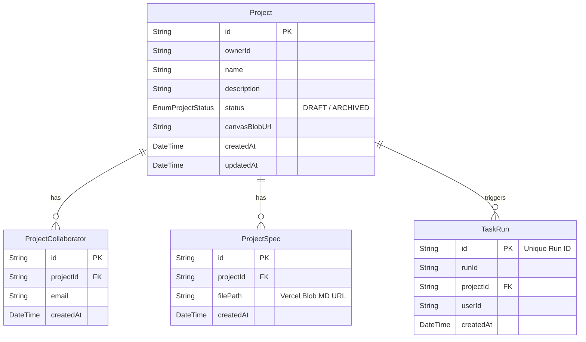
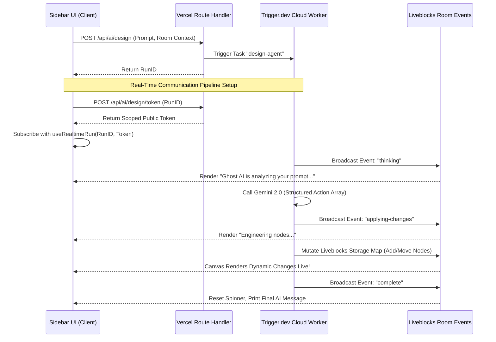

# Ghost AI: Full-Stack Collaborative System Architecture & Operations Guide

Welcome to the comprehensive documentation of **Ghost AI**—a state-of-the-art, real-time collaborative system design canvas and document-generation engine. This document details every layer of the system: from authentication guards and database structures to collaborative canvas physics and durable AI background tasks.

---

## Table of Contents
1. [System Topology & High-Level Architecture](#1-system-topology--high-level-architecture)
2. [Technology Stack](#2-technology-stack)
3. [Database & Storage Architecture](#3-database--storage-architecture)
4. [Routing, Middleware & Authentication Protocols](#4-routing-middleware--authentication-protocols)
5. [Frontend Collaborative Canvas & Workspace](#5-frontend-collaborative-canvas--workspace)
6. [Sidebar, AI Chats & Event Feeds](#6-sidebar-ai-chats--event-feeds)
7. [Durable AI Agent Task Workflows (Trigger.dev)](#7-durable-ai-agent-task-workflows-triggerdev)
8. [Production Operations & Deployment Blueprint](#8-production-operations--deployment-blueprint)

---

## 1. System Topology & High-Level Architecture

Ghost AI is designed around a **hybrid serverless + event-driven background worker** architecture. This separates low-latency user interactions (multiplayer movements and shape resizing) from long-running, compute-heavy AI tasks (diagram engineering and system spec generation).



---

## 2. Technology Stack

Ghost AI is engineered using a curated, modern toolchain:

| Layer | Technology | Purpose / Implementation |
| :--- | :--- | :--- |
| **Core Framework** | **Next.js 16.2.4 (React 19)** | App Router, Server Components, and optimized Turbopack build engine. |
| **Styling** | **Tailwind CSS v4 & Vanilla CSS** | Modern theme tokens with inline `@theme` directives. Zero legacy configurations. |
| **Component Kit** | **shadcn/ui & Radix Primitives** | Dark-only theme configuration with robust, fully styled, accessible components. |
| **Identity & Access** | **Clerk (@clerk/nextjs & @clerk/ui)** | Secure session tokens, social sign-ins, and server-side route guarding. |
| **Multiplayer / Presence** | **Liveblocks Client & React Flow** | Real-time presence (cursors, thinking indicators) and custom flow node models. |
| **Database Client** | **Prisma ORM (v7.8.0)** | PostgreSQL client with custom edge driver adapter `@prisma/adapter-pg`. |
| **Object Storage** | **Vercel Blob (`@vercel/blob`)** | Secure cloud storage for canvas autosave snapshots and compiled Markdown specifications. |
| **AI Background Orchestrator**| **Trigger.dev (v3 SDK `^4.4.6`)** | Durable cloud workers handling long-running Gemini API requests without timing out. |
| **Generative Intelligence** | **Gemini 2.0 Flash (`@ai-sdk/google`)** | Highly performant model generating clean React Flow nodes and specifications in parallel. |

---

## 3. Database & Storage Architecture

The database resides in a PostgreSQL instance managed via multi-file Prisma schemas under `/prisma/models/`.



### Data Storage Strategy
1. **Relational Database (PostgreSQL):** Stores high-level, indexable metadata: project properties, collaborator listings, task traces, and specifications records.
2. **Object Store (Vercel Blob):** Stores large, volatile documents:
   * **Canvas State:** `canvas/{projectId}.json` stores the JSON graph containing React Flow nodes, edge structures, labels, and styles. Overwritten on a 2-second debounced autosave loop.
   * **Generated Specifications:** `specs/{projectId}/{timestamp}.md` stores private, raw markdown documents returned by the AI spec task.

---

## 4. Routing, Middleware & Authentication Protocols

```
┌────────────────────────────────────────────────────────┐
│                      PROXY.TS (MIDDLEWARE)             │
│                                                        │
│  [Any Request] ──► Protects all routes except:         │
│                      ├── /sign-in                      │
│                      └── /sign-up                      │
└───────────────────────────┬────────────────────────────┘
                            │ (Authenticated)
                            ▼
 ┌──────────────────────────────────────────────────────┐
 │                      APP ROUTER                      │
 ├──────────────────────────┬───────────────────────────┤
 │     [Static Routes]      │     [Dynamic Routes]      │
 │  ├── /                   │  ├── /editor/[roomId]     │
 │  └── /editor (Home)      │  └── /api/projects/...    │
 └──────────────────────────┴───────────────────────────┘
```

### The Authentication Guard Flow
Session security is enforced in **`proxy.ts`** at the root of the project:
* **Clerk Middleware:** Integrates `clerkMiddleware` and `createRouteMatcher` to secure all workspace interfaces.
* **Public Routes:** Only `/sign-in` and `/sign-up` are public.
* **Root Redirection (`/`):** If a user hits `/`, the root page checks if they are logged in:
  * **Authenticated:** Instantly redirects to `/editor`.
  * **Unauthenticated:** Instantly redirects to `/sign-in`.

### Workspace Guards & Permission matrix
When loading a dynamic room via `/editor/[roomId]`, the server executes **`lib/project-access.ts`**:
1. Checks the user's primary email address and Clerk User ID.
2. Performs a query against PostgreSQL:
   * **Is Owner?** If the project's `ownerId` matches the User ID, access is GRANTED.
   * **Is Collaborator?** If there is a record in `ProjectCollaborator` matching this `projectId` and the user's email, access is GRANTED.
   * **Denied:** If neither criteria is met, Next.js blocks rendering and displays the **`access-denied.tsx`** screen.

### Comprehensive API Routing Directory

| Endpoint | Method | Security | Purpose |
| :--- | :--- | :--- | :--- |
| `/api/projects` | `GET` | Clerk Authenticated | Lists all projects owned by the user, and all projects shared with their email. |
| `/api/projects` | `POST` | Clerk Authenticated | Creates a new database record initialized with default canvas structures. |
| `/api/projects/[projectId]` | `PATCH` | Owner Only | Renames project metadata (name, description, status). |
| `/api/projects/[projectId]` | `DELETE`| Owner Only | Cascade-deletes project, collaborator lists, specs, and storage files. |
| `/api/projects/[projectId]/collaborators` | `GET` | Authenticated | Lists all invitees enriched with Clerk profile avatars. |
| `/api/projects/[projectId]/collaborators` | `POST` | Owner Only | Normalizes an email to lowercase and writes it to collaborators list. |
| `/api/projects/[projectId]/collaborators` | `DELETE`| Owner Only | Removes a collaborator's access to the project. |
| `/api/projects/[projectId]/canvas` | `GET` | Access Guarded | Fetches the saved canvas JSON from Vercel Blob. |
| `/api/projects/[projectId]/canvas` | `PUT` | Access Guarded | Debounces and uploads the latest canvas state snapshot to Vercel Blob. |
| `/api/projects/[projectId]/specs` | `GET` | Access Guarded | Lists all historical Markdown specifications generated for this project. |
| `/api/projects/[projectId]/specs/[specId]/download` | `GET` | Access Guarded | Streams the specification file back as a browser attachment download. |
| `/api/ai/design` | `POST` | Access Guarded | Triggers the Trigger.dev `design-agent` task for diagram modifications. |
| `/api/ai/design/token` | `POST` | Access Guarded | Resolves the ownership of a `TaskRun` and returns a scoped public token. |
| `/api/ai/spec` | `POST` | Access Guarded | Triggers the Trigger.dev `generate-spec` task. |
| `/api/ai/spec/token` | `POST` | Access Guarded | Resolves ownership and issues a scoped token to stream run status in real time. |
| `/api/liveblocks-auth` | `POST` | Clerk Authenticated | Performs workspace check, claims dynamic username/avatar, issues JWT token. |

---

## 5. Frontend Collaborative Canvas & Workspace

The centerpiece of Ghost AI is a responsive layout composed of an adjustable sidebar on the left, a React Flow collaborative canvas in the center, and a multi-tab AI sidebar sliding in from the right.

```
┌────────────────────────────────────────────────────────────────────────┐
│                              EDITOR NAVBAR                             │
├─────────────────┬────────────────────────────────────────┬─────────────┤
│ Project Sidebar │           REACT FLOW CANVAS            │ AI Workspace│
│                 │                                        │             │
│ [My Projects]   │  ┌──────┐          ┌──────┐            │  AI Chat    │
│ [Shared]        │  │Node A├─────────►│Node B│            │             │
│                 │  └──────┘          └──────┘            │  Specs      │
│                 ├────────────────────────────────────────┤             │
│                 │ [Controls]       [Toolbar] [Autosave]  │             │
└─────────────────┴────────────────────────────────────────┴─────────────┘
```

### Key Interactive Canvas Mechanics

1. **Shape Panel (Bottom-Center Floating Bar):**
   * Renders 6 geometric shapes (Rectangle, Pill, Circle, Diamond, Hexagon, Cylinder).
   * Supports **Drag-and-Drop:** Uses React's drag events to pass custom metadata (shape type, dimensions). Drops write dynamically to the collaborative Liveblocks storage map.
   * Supresses standard browser ghost previews via an off-screen 1px image, tracking mouse coordinates to draw a beautiful visual indicator under the cursor.

2. **Custom Nodes (`canvas-node.tsx`):**
   * Renders shape-specific geometries dynamically using border-radius configurations or inline SVGs with `preserveAspectRatio="none"`.
   * Integrates an inline textarea double-click trigger, locking focus, stopping event propagation, and saving changes to storage on blur.
   * Renders `NodeResizer` controls when selected, showing subtle resizing handles at node extremities.

3. **Custom Connections (`canvas-edge.tsx`):**
   * Computes custom right-angle path routing using `@xyflow/react`'s `getSmoothStepPath`.
   * Renders dynamic inline editable labels centered on the path, utilizing a wide invisible path wrapper to ensure clicking the connection is effortless.

4. **Keyboard Ergonomics (`useKeyboardShortcuts.ts`):**
   * Wire hotkeys directly to React Flow and Liveblocks:
     * `Ctrl + Z` / `Cmd + Z` for **Undo**.
     * `Ctrl + Shift + Z` / `Ctrl + Y` for **Redo**.
     * `+` / `-` for **Canvas Zooming**.
   * Bypasses keys when user inputs, textareas, or active editors have focus.

5. **Starter Templates (`starter-templates.ts`):**
   * Provides blueprints for Microservices Architectures, CI/CD Pipelines, and Event-Driven Systems.
   * Replaces canvas elements dynamically, cleaning out historical nodes/edges, loading design coordinates, and automatically fitting to screen view.

6. **Presence Cursors & Stacked Avatars (`presence-cursors.tsx` & `collaborator-avatars.tsx`):**
   * Maps client cursors into React Flow's coordinate space, displaying custom color-coded pointers with names and real-time activity indicators (e.g., blinking thinking spinners).
   * Displays an overlapping user avatar stack in the top-right corner, letting you see everyone working in the room at a glance.

---

## 6. Sidebar, AI Chats & Event Feeds

The AI Workspace sidebar resides on the right side of the screen. It is powered by Liveblocks Event Channels and Trigger.dev Real-time hooks:



### Sidebar Tabs
1. **AI Architect:** Natural language interface to edit, expand, or build diagrams. Displays compact live-status indicators (e.g., *"Analyzing requirements..."*, *"Constructing database connections..."*).
2. **Chat:** A shared conversation feed stored inside the Liveblocks room's `"ai-chat"` feed, enabling all active workspace participants to see previous requests and prompts.
3. **Specs:** The documentation control center. Allows you to initiate spec generation, view progress, open interactive Markdown previews inside a dialog, and download specifications as standard attachments.

---

## 7. Durable AI Agent Task Workflows (Trigger.dev)

Our background agents use **Gemini 2.0 Flash** via `@ai-sdk/google` to execute complex design decisions securely without blocking the Next.js server thread.

### Task A: The Design Agent (`trigger/design-agent.ts`)
* **Objective:** Interpret a user prompt and modify the React Flow chart.
* **Structured Output Schema:** Enforces structural output parsing using `gemini-2.0-flash` with a Zod schema to generate an array of graph instructions:
  * **Add Node:** Creates fresh nodes (geometry, type, default colors).
  * **Move Node:** Repositions nodes smoothly to clean up layouts.
  * **Resize Node:** Updates dimensions based on node complexity.
  * **Update Node:** Renames labels or updates styling.
  * **Delete Node:** Removes elements and cleans up broken connections.
  * **Add Edge:** Generates smooth step connections between shapes.
  * **Delete Edge:** Clears connections cleanly.
* **Event Dispatching:** Connects to the Liveblocks REST API, broadcasting live status updates (`thinking`, `applying-changes`, `complete`) to the client chat feed.
* **Storage Mutation:** Instantiates a direct transaction on Liveblocks, updating collaborative storage maps, which automatically triggers React Flow to render the updates for all active users.

### Task B: The Spec Generator (`trigger/generate-spec.ts`)
* **Objective:** Produce highly detailed system specifications from the canvas layout.
* **Input Payload:** Receives the current project ID, active user ID, canvas JSON structure (nodes/edges), and historical sidebar chat transcripts.
* **Structured Spec Compilation:** Feeds the entire topology context to the Gemini model to write comprehensive documentation containing architecture directories, component breakdowns, data models, and sequence workflows.
* **Persistence & Download Flow:**
  1. Compiles the markdown document.
  2. Uploads the generated file securely to Vercel Blob under `specs/{projectId}/{timestamp}.md`.
  3. Creates a new database record in `ProjectSpec` containing the blob URL.
  4. Returns the compiled specification back to the frontend.
  5. The Vercel download route stream returns the file with headers set to `Content-Disposition: attachment; filename="{spec-name}.md"`.

---

## 8. Production Operations & Deployment Blueprint

When shipping Ghost AI to production, use this deployment structure to ensure all services are connected securely.

### 1. Database Provisioning
Ensure your database (e.g., Prisma Postgres) is active. Apply migrations to seed your remote database structure:
```bash
npx prisma db push
```

### 2. Vercel Hosting Dashboard
1. Connect your GitHub repository: `Sharingan-rt/Ghost_ai`.
2. Select the **Next.js** framework preset.
3. Paste all local `.env` variables into the Vercel Project Settings.
4. Set the `APP_URL` variable to your production link (e.g. `https://ghost-ai.vercel.app`).
5. Click **Deploy**.

### 3. Trigger.dev Cloud Setup
1. Log into your [Trigger.dev Dashboard](https://cloud.trigger.dev).
2. Create your project, and copy your `TRIGGER_PROJECT_REF` and `TRIGGER_SECRET_KEY` into your Vercel Environment Variables.
3. In your local terminal, run the compiler deployment:
   ```bash
   npx trigger.dev@latest deploy
   ```
4. **Environment Keys (Critical):** On your Trigger.dev Project Settings page, add the following key-value pairs so your cloud tasks can run securely:
   * `GEMINI_API_KEY`
   * `LIVEBLOCKS_SECRET_KEY`
   * `DATABASE_URL`
   * `BLOB_READ_WRITE_TOKEN`

---

*Compiled by Antigravity AI — May 2026*
